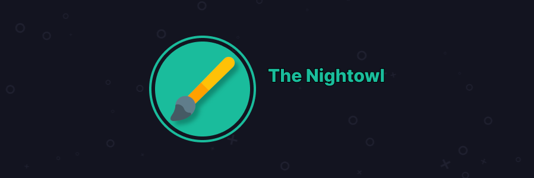

# The Nightowl
This nightowl brings ease to your eyes in the night, without ruining Discord's defaults that make you learn something for no reason.

# Features
* Sane defaults
* Made for Vizality (Dashboard etc should feel natural)
* Does not change default placements in the sake of being "nicer" (I am looking at you, half of the themes for Discord)
* Eases your eyes, while looking nice too.

# Disadvantages
* WIP right now
* Pretty messed up (right now)
* Made by a guy that only knows basic (s)css and only uses Vizality :p

# Installation

## Cloning
Open your terminal/cmd. Go to the Vizality/Powercord's Themes folder, then clone the repository using the command `git clone https://kreatea.ml/kreato/the-nightowl`

## pma
The nightowl is also available on PMA, run `pma -S the-nightowl` to install it.

# Credits
Logo icon taken from [here](https://www.flaticon.com/free-icon/brush_891703?term=brush&page=1&position=59&page=1&position=59&related_id=891703&origin=tag#)
